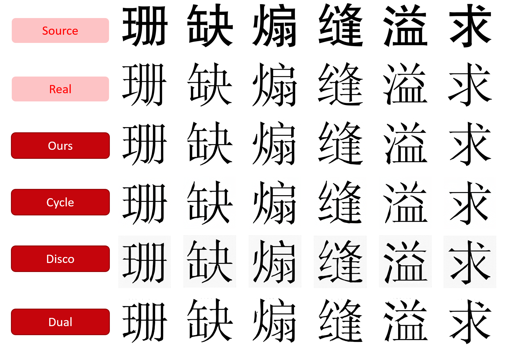
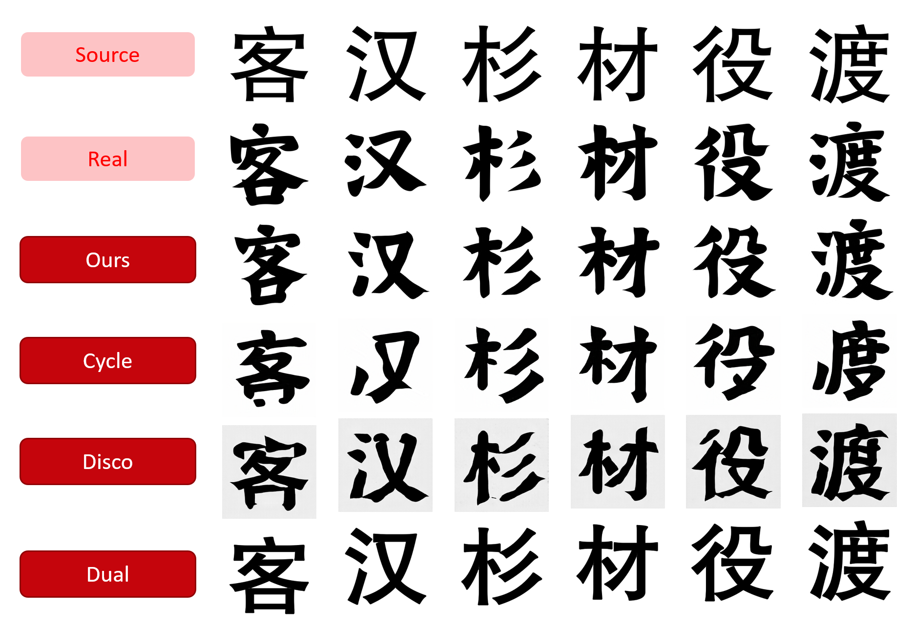
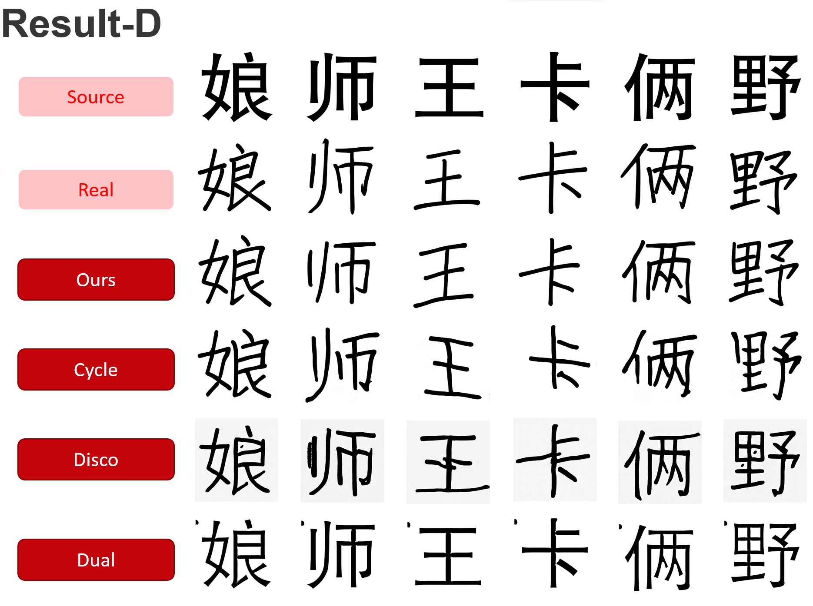
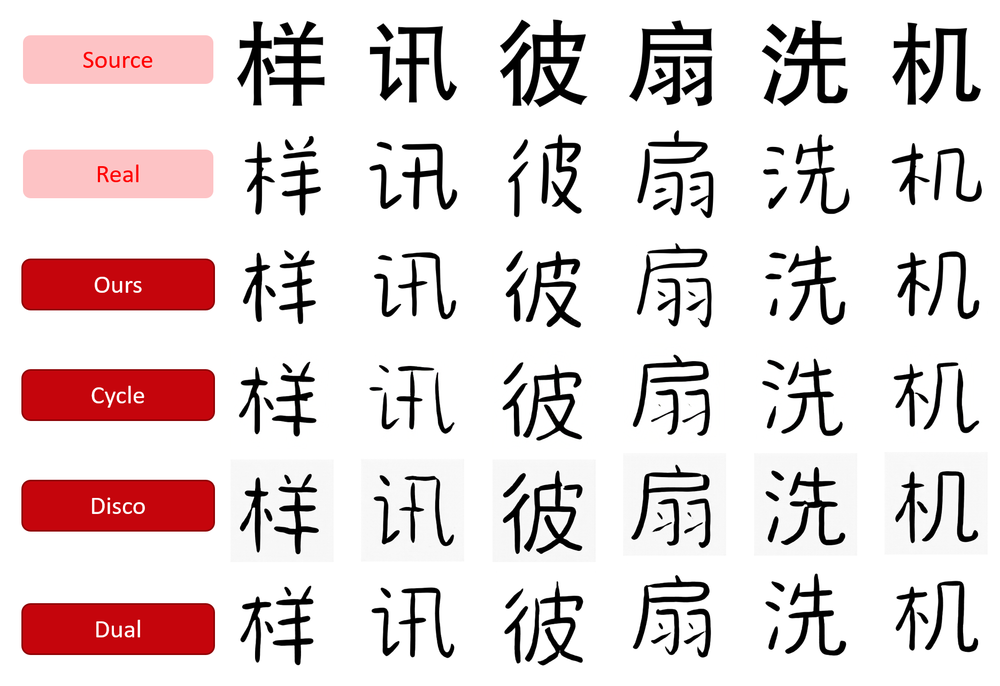

# Results & Discussion

## Animation

  
  <figcaption>If you haven't seen this animation in our home page, this is the style transfer in action.</figcaption>

## Comparison with others

### CycleGAN & DiscoGAN

  
  <figcaption>Result of CycleGAN & DiscoGAN</figcaption>

Overall the characters generated by CycleGAN are recognizable, however, some characters suffered from missing/broken strokes and some other appeared in the wrong direction.

### DualGAN

  
  <figcaption>Result of DualGAN</figcaption>

For DualGAN, the structure of its generator and discriminator helps it to maintain a more stable and complete output structure. However, the strong constraints prevent it from learning the main characteristics of different fonts.

### Ours

  
  <figcaption>Result of ours</figcaption>

The results from our model is visibily the best across all 4 fonts as we elimated previous issues that appeared in CycleGAN.

## Gallery

All models are trained for 100 epochs.

### Style B

### Style C

### Style D

### Style E

## Full Gallery of our model

(Require UW Madison Login)  
[Style B](https://uwprod-my.sharepoint.com/:f:/g/personal/ctseng27_wisc_edu/Eo7ch2unD5JPl4WHPhI_obkBIg5JMCkbsprU-3t9a9TkVw?e=FAPOUJ)
[Style C](https://uwprod-my.sharepoint.com/:f:/g/personal/ctseng27_wisc_edu/En_bcDIdrM5Pkdg9b_aCT-EBghf04zFWejXwPMjHFJZRBg?e=jPEyQ6)
[Style D](https://uwprod-my.sharepoint.com/:f:/g/personal/ctseng27_wisc_edu/ErvhPyV9grpEhgSq3mDWLrgBJRhxkNRj0DxkETc576CRrg?e=wamE7b)
[Style E](https://uwprod-my.sharepoint.com/:f:/g/personal/ctseng27_wisc_edu/EtOQeHOOmmNFjUyAJHyvwuYBClS9n4GijdNdxeA8R9-WzQ?e=bu9ix2)
